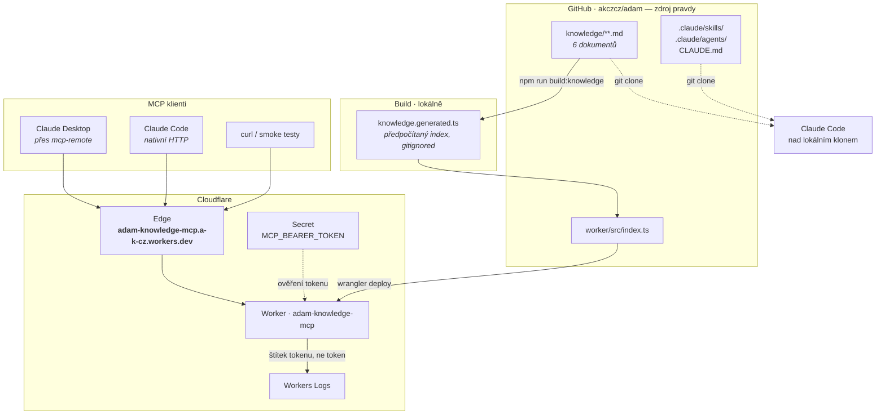
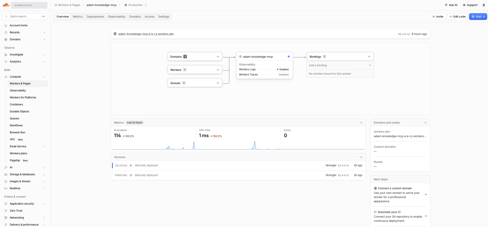
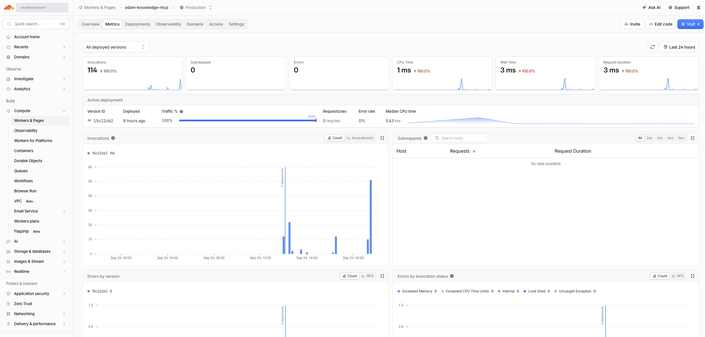
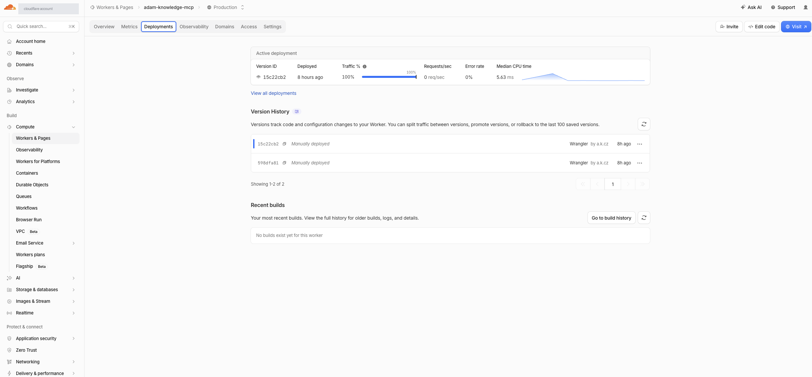
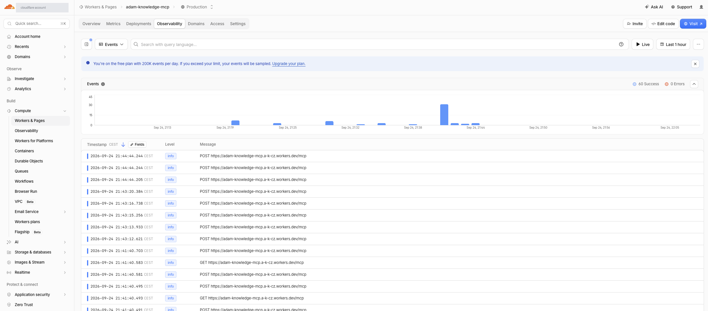
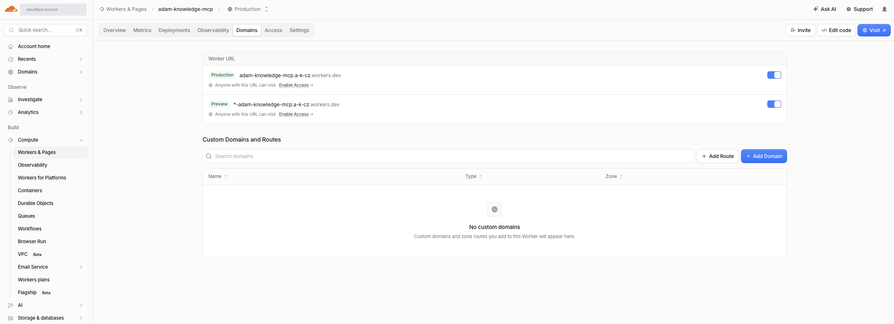

# Architektura

Znalostní báze v `knowledge/` je jeden zdroj pravdy, který se konzumuje **dvěma cestami**:

- **lokálně** – Claude Code čte `CLAUDE.md`, `knowledge/`, `.claude/skills/` a `.claude/agents/` přímo z klonu repozitáře,
- **vzdáleně** – jako MCP server běžící na Cloudflare Workers, ke kterému se připojí libovolný MCP klient.

Vzdálená cesta nese **jen `knowledge/`**. Skills a agenti se přes MCP nedistribuují – jsou to instrukce pro Claude Code, ne data.

## Komponenty



## Průběh requestu

```mermaid
sequenceDiagram
    participant C as MCP klient
    participant E as Cloudflare edge
    participant W as Worker
    participant L as Workers Logs

    C->>E: POST /mcp<br/>Authorization: Bearer &lt;token&gt;
    E->>W: fetch(request)
    alt /health
        W-->>C: 200 · stav, počet dokumentů (bez tokenu)
    else chybí nebo neplatný token
        W-->>C: 401 · WWW-Authenticate: Bearer
    else token sedí
        W->>L: "mcp auth ok: <štítek>"
        W->>W: lookup v předpočítaném indexu
        W-->>C: 200 · JSON-RPC odpověď
    end
```

## Proč je to postavené takhle

| Rozhodnutí | Důvod | Důsledek |
|---|---|---|
| Index se počítá při buildu, ne za běhu | Workers Free tier dává **10 ms CPU na request** | Hledání je jen lookup v mapě; naměřený medián **5,63 ms** – rezerva není velká |
| `knowledge.generated.ts` je build artefakt mimo git | Zdrojem pravdy je Markdown, ne jeho derivát | Po změně `knowledge/` je nutný `npm run build:knowledge` + redeploy |
| Stateless HTTP transport | Claude API connector jede zatím na éru `2025-11-25` | Worker obsluhuje legacy i moderní éru `2026-07-28` současně |
| Read-only, žádná mutace | Zápis patří do gitu, ne do běžícího Workeru | Auditovatelnost přes git historii, ne přes aplikační logy |
| Sdílený bearer token | Dočasné řešení pro testování v malé skupině | **Bude nahrazeno** – viz [Omezení](#známá-omezení) |
| Bez bindings, KV, D1 a Queues | Báze je malá a vejde se do bundlu | Nulová stavová plocha, nulové další náklady |

## Cloudflare – co je kde vidět

### Overview

Rozcestník: doména, stav observability, poslední nasazení, základní metriky.



### Metrics

Invocations, CPU time, wall time, error rate. Tady se hlídá, jestli se medián CPU nepřibližuje limitu 10 ms.



### Deployments

Historie verzí. Nasazuje se ručně Wranglerem, CI zatím napojené není – každá verze jde vrátit zpět (rollback až 100 verzí).



### Observability → Events

Log jednotlivých requestů. Tady se po nasazení multi-token verze pozná **podle štítku**, který token se připojuje.



> Free plán dává 200K událostí denně; nad limit se začne vzorkovat.

### Domains

Produkční a preview URL. Custom doména zatím žádná.



> ⚠️ `Anyone with this URL can visit` znamená, že endpoint je veřejně dostupný – jediná ochrana je bearer token ve Workeru. Cloudflare Access před něj zatím předřazený není.

## Rozhraní, které server nabízí

| Typ | Název | Co dělá |
|---|---|---|
| Tool | `search_knowledge` | Fulltext napříč bází, vrací relevantní sekce i se zdrojem a datem ověření |
| Tool | `protocol_status` | Strukturovaný stav jednoho protokolu: verze, zralost, `naposledy_overeno`, zdroje, otevřené otázky |
| Resource | `knowledge://<id>` | Celý dokument jako Markdown (6 ks) |
| Endpoint | `GET /health` | Stav bez autentizace – neprozrazuje nic o obsahu |

## Známá omezení

1. **Autentizace.** Sdílený statický bearer token. Od verze s více tokeny lze odvolat jeden, aniž by to shodilo ostatní, a v logu je vidět štítek – ale pořád to není pořádné authN. Cílový stav je OAuth podle MCP spec, nebo předřazení Cloudflare Access.
2. **Žádný rate limiting.** Endpoint je veřejně dosažitelný a token je jediná brána.
3. **Ruční deploy.** `wrangler deploy` z lokálu. Změna v `knowledge/` se na server nedostane, dokud ji někdo nenasadí.
4. **CPU rezerva.** Medián 5,63 ms proti limitu 10 ms. Výrazný růst báze si vyžádá buď placený tier, nebo přesun indexu mimo bundle.
