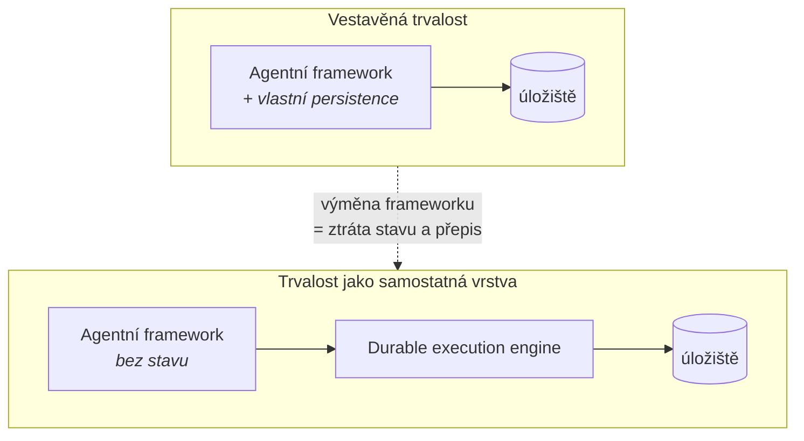

# Durable execution

## Proč to je samostatná vrstva

Dlouhoběžící agent potřebuje, aby rozpracovaný běh přežil pád procesu, restart clusteru
a čekání na lidské rozhodnutí v řádu dnů. To je **durable execution** – běh se průběžně
zapisuje do trvalého úložiště a po restartu pokračuje z posledního bodu, ne od začátku.

Skoro každý agentní framework si tuhle vrstvu dělá po svém. A právě tady bývá licenční hranice
mezi zdarma a placeným (viz [licencni-vzorce.md](licencni-vzorce.md)).

## Architektonický tah: vytáhnout ji z frameworku ven

| | Vestavěná trvalost | Samostatná vrstva |
|---|---|---|
| Výměna frameworku | Přepis včetně stavové logiky | Změna adaptéru |
| Licenční riziko | Soustředěné do jednoho projektu | Rozdělené, každá vrstva ověřená zvlášť |
| Provoz | Jeden systém | Dva systémy k provozování |
| Vhodné pro | Prototyp, jednoduchý use-case | Produkt dodávaný zákazníkovi |

Cenou je jeden systém navíc v provozu. Pro platformu, která má přežít výměnu frameworku
a licenční změnu, se to vyplatí.

## Kandidáti (ověřeno 2026-09-27)

| Engine | Licence | OSI? | Governance | Kde je stav |
|---|---|---|---|---|
| **Temporal** | **MIT** (server) | Ano | Temporal Technologies, jeden vendor | Vlastní cluster; provozně těžší |
| **Dapr Workflows** | **Apache-2.0** | Ano | **CNCF Graduated** (od 10/2024) | **V tvém state storu – 28 providerů, dokumentovaný append-only formát** |
| **Restate** | **BUSL** (runtime), MIT (SDK) | **Ne** (runtime) | Restate, jeden vendor | Vlastní binárník, nejmenší provozní stopa |
| **Inngest** | **SSPL** | **Ne** | Inngest, jeden vendor | Restriktivní u poskytování služby |
| **DBOS** | ověřit | ověřit | ověřit | Postgres-native přístup |
| **Azure Durable Task Scheduler** | SDK **MIT**, backend **proprietární Azure služba** | **Ne** (backend) | Microsoft, jeden vendor, CLA | **Uvnitř Azure služby**; emulátor jen pro vývoj |
| **DurableTask MSSQL provider** | **MIT** | Ano | Microsoft, jeden vendor | **V tvém MS SQL** – *„cloud or your own infrastructure"*; **jen .NET** |

**Pozn. Adam:** kombinace „OSI licence + nadace + graduated" má dnes jen **Dapr**.
Temporal je licenčně čistý (MIT), ale je to jeden vendor s CLA – platí u něj riziko
relicencování popsané v [licencni-vzorce.md](licencni-vzorce.md). Rozdíl je v tom,
že MIT verzi už nikdo nevezme zpátky; relicencování by se týkalo budoucích verzí.

## Když monetizovaná není licence, ale backend

MAF Durable Extension je **celý MIT** – repozitář, PyPI i .NET balíček. Přesto je jeho
durable execution nepřenositelná, protože jediný produkční backend, na který se SDK umí
připojit, je **placená Azure služba** (Durable Task Scheduler, `*.durabletask.io`).
Emulátor podle dokumentace *„isn't suitable for production use"*.

**License gate to nenajde – všechno je MIT.** Odhalí se to jen tím, že si přečteš,
na co se runtime připojuje. Detail viz čtvrtý vzorec v [licencni-vzorce.md](licencni-vzorce.md).

### Zpřesnění po ověření kódu (2026-09-29)

Past **není ve frameworku, ale v dokumentované cestě a v Python SDK**. MAF registruje
generické buildery `Microsoft.DurableTask` a storage provider určuje volající delegát.
Cesta ven existuje – [`Microsoft.DurableTask.SqlServer`](https://github.com/microsoft/durabletask-mssql)
(MIT, živý) persistuje stav do MS SQL kdekoliv – **ale jen na .NET**. Python balíček
`durabletask` je popsaný jako *„requires Azure Durable Task Scheduler, it is not a generic
gRPC sidecar connector"*.

Netherite jako alternativa **odpadá** – podpora končí **2028-03-31**.

A směr vývoje jde proti: `microsoft/durabletask-go` uvádí *„DTS is the only supported
runtime. This SDK does not include a storage backend."* `dapr/durabletask-go` je fork,
který si embeddable engine s vlastními backendy ponechal.

**Pozn. Adam:** obranný vzor „vytlačit durable vrstvu ven" tedy platí dál, jen z jiného
důvodu – ne že vytlačovat není kam, ale že jediná cesta ven zamyká do .NET a jede proti
směru ekosystému.

## Vztah k agentním frameworkům

**Dapr Agents** (Apache-2.0, GA březen 2026) staví přímo na durable execution Dapru –
trvalost tedy není doplněk, ale vlastnost runtimu, a je ve stejné licenci jako zbytek.
To je dnes nejčistší kombinace, jakou lze složit.

Návrh na přesun Dapr Agents pod **Agentic AI Foundation** (pod jménem *Durable Agents*)
byl podán **2026-06-02**, hlasování TC uzavřeno 2026-09-03 a **zamítnut 2026-09-11**.
Projekt zůstává pod Dapr / CNCF / Linux Foundation.

Struktura governance se tím nezhoršuje. Zhoršuje se ale obrázek o **neutralitě vrstvy** –
odůvodnění komise je architektonicky důležitější než výsledek a je to trojí nezávislé
potvrzení rizika „jak drahé je vzít stav jinam":

1. Záruky trvalosti jsou demonstrované **jen nad Dapr Workflow** – *„every guarantee it
   offers is currently expressed through Dapr Workflow"*.
2. **Rozhodující bod:** žádná jiná durable-execution komunita o to nestojí; deklarovaný
   Temporal provider nestačil.
3. Projekt *„reads more as an agent framework than as a substrate"*.

Governance ani security posture zpochybněné nebyly. Resubmise je možná bez čekací lhůty –
**sledovat, jestli přibude druhý durable backend**, je to přímý indikátor ceny odchodu.

> ⚠️ **Pozor na zdroj zralosti.** CNCF Graduated se vztahuje na **Dapr runtime**, ne na
> Dapr Agents: repozitář sub-projektu vznikl 2025-01-02, tedy dva měsíce **po** graduaci
> (2024-10-30). Sub-projekt navíc nemá vlastní support ani versioning policy.

### Provozní past Dapru

Scheduler má ve výchozím nastavení **embedded etcd** a *„scaling the Scheduler service
replicas up or down is not possible without incurring data loss"*. Drží přitom reminders,
které probouzejí pozastavená workflow – tedy i čekající schvalovací body.
Pro produkt dodávaný zákazníkovi zvážit **externí etcd** (`--etcd-embed=false`)
a zálohování podle stanoveného RPO.

### Google ADK: store konverzace ≠ durable execution

Rozdíl, který se snadno přehlédne. ADK `DatabaseSessionService` (extra `[db]`, dialekty
sqlite / Postgres / MySQL / MSSQL / Spanner) ukládá **session, eventy a stav jako JSON**
a přežije restart procesu. **Není to durable execution engine.**

Obnovení běhu dělá `ResumabilityConfig(is_resumable=True)` – a to je jiná liga:

- třída je `@experimental`, výchozí hodnota `False`
- docstring: *„we only guarantee an **at-least-once** behavior once resumed"*
- dokumentace: nástroje *„are run at least once, and may run more than once when resuming"*
- dočasný in-memory stav se ztrácí; maximální horizont čekání nedokumentovaný

**Pozn. Adam:** pro schvalovací bod v regulovaném procesu to znamená **idempotency key
na naší straně**. Neidempotentní akce za schvalovacím bodem se při obnovení může
provést podruhé. Je to zároveň dobrá připomínka, že „přežije restart" a „obnoví se
korektně" jsou dvě různá tvrzení.

## Otevřené otázky
- [ ] DBOS – licence, governance, provozní model.
- [ ] Temporal: vyžaduje CLA? Jaká je struktura přispěvatelů mimo vendora?
- [ ] Jak se durable execution snáší s protokolovou hranicí A2A – kde končí běh jednoho agenta.
- [ ] Praktický dopad BUSL u Restate na dodávku produktu on-prem (otázka na právníka).
- [ ] ADK resume: chová se kagentí `KAgentSessionService` při at-least-once obnovení
      stejně jako `DatabaseSessionService`? Netestováno.
- [ ] Lze MAF workflow spustit nad Dapr Workflow nebo Temporalem bez `agent-framework-durabletask`?
- [ ] Změřit harnessem: pozastavení na lidské rozhodnutí → restart clusteru → obnovení
      po 14 dnech. Ani jeden kandidát nemá dokumentovaný maximální horizont čekání.

## Changelog
- 2026-09-27: první verze.
- 2026-09-29: doplněn Google ADK – store konverzace není durable execution, resume je
  experimentální a at-least-once.
- 2026-09-29: ověřeno, že MAF backend nevynucuje; doplněn MSSQL provider jako cestu
  mimo Azure (jen .NET) a vyřazen Netherite (konec podpory 2028-03-31).
- 2026-09-29: doplněn Azure Durable Task Scheduler a vzorec „monetizovaný backend".
- 2026-09-28: opraveno datum a odůvodnění zamítnutí v AAIF; doplněno, že CNCF Graduated
  se nevztahuje na Dapr Agents; přidána provozní past Scheduleru.
