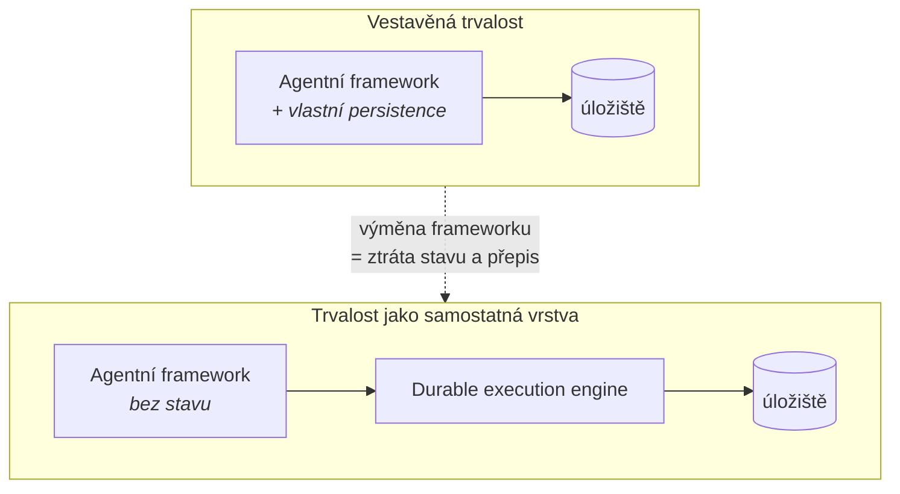

# Durable execution

## Proč to je samostatná vrstva

Dlouhoběžící agent potřebuje, aby rozpracovaný běh přežil pád procesu, restart clusteru
a čekání na lidské rozhodnutí v řádu dnů. To je **durable execution** – běh se průběžně
zapisuje do trvalého úložiště a po restartu pokračuje z posledního bodu, ne od začátku.

Skoro každý agentní framework si tuhle vrstvu dělá po svém. A právě tady bývá licenční hranice
mezi zdarma a placeným (viz [licencni-vzorce.md](licencni-vzorce.md)).

## Architektonický tah: vytáhnout ji z frameworku ven

| | Vestavěná trvalost | Samostatná vrstva |
|---|---|---|
| Výměna frameworku | Přepis včetně stavové logiky | Změna adaptéru |
| Licenční riziko | Soustředěné do jednoho projektu | Rozdělené, každá vrstva ověřená zvlášť |
| Provoz | Jeden systém | Dva systémy k provozování |
| Vhodné pro | Prototyp, jednoduchý use-case | Produkt dodávaný zákazníkovi |

Cenou je jeden systém navíc v provozu. Pro platformu, která má přežít výměnu frameworku
a licenční změnu, se to vyplatí.

## Kandidáti (ověřeno 2026-09-27)

| Engine | Licence | OSI? | Governance | Poznámka |
|---|---|---|---|---|
| **Temporal** | **MIT** (server) | Ano | Temporal Technologies, jeden vendor | Nejrozšířenější; provozně těžší (cluster + závislosti) |
| **Dapr Workflows** | **Apache-2.0** | Ano | **CNCF Graduated** (od 10/2024) | Nejlepší governance profil; durable execution je součást runtimu |
| **Restate** | **BUSL** (runtime), MIT (SDK) | **Ne** (runtime) | Restate, jeden vendor | Nejmenší provozní stopa – jeden binárník bez závislostí |
| **Inngest** | **SSPL** | **Ne** | Inngest, jeden vendor | Restriktivní u poskytování služby |
| **DBOS** | ověřit | ověřit | ověřit | Postgres-native přístup |

**Pozn. Adam:** kombinace „OSI licence + nadace + graduated" má dnes jen **Dapr**.
Temporal je licenčně čistý (MIT), ale je to jeden vendor s CLA – platí u něj riziko
relicencování popsané v [licencni-vzorce.md](licencni-vzorce.md). Rozdíl je v tom,
že MIT verzi už nikdo nevezme zpátky; relicencování by se týkalo budoucích verzí.

## Vztah k agentním frameworkům

**Dapr Agents** (Apache-2.0, GA březen 2026) staví přímo na durable execution Dapru –
trvalost tedy není doplněk, ale vlastnost runtimu, a je ve stejné licenci jako zbytek.
To je dnes nejčistší kombinace, jakou lze složit.

Návrh na přesun Dapr Agents pod **Agentic AI Foundation** (pod jménem *Durable Agents*)
byl v červnu 2026 **zamítnut**; projekt zůstává pod Dapr / CNCF / Linux Foundation.
Z hlediska governance to nic nezhoršuje – CNCF Graduated je vyšší záruka než nová nadace.

## Otevřené otázky
- [ ] DBOS – licence, governance, provozní model.
- [ ] Temporal: vyžaduje CLA? Jaká je struktura přispěvatelů mimo vendora?
- [ ] Jak se durable execution snáší s protokolovou hranicí A2A – kde končí běh jednoho agenta.
- [ ] Praktický dopad BUSL u Restate na dodávku produktu on-prem (otázka na právníka).

## Changelog
- 2026-09-27: první verze.
