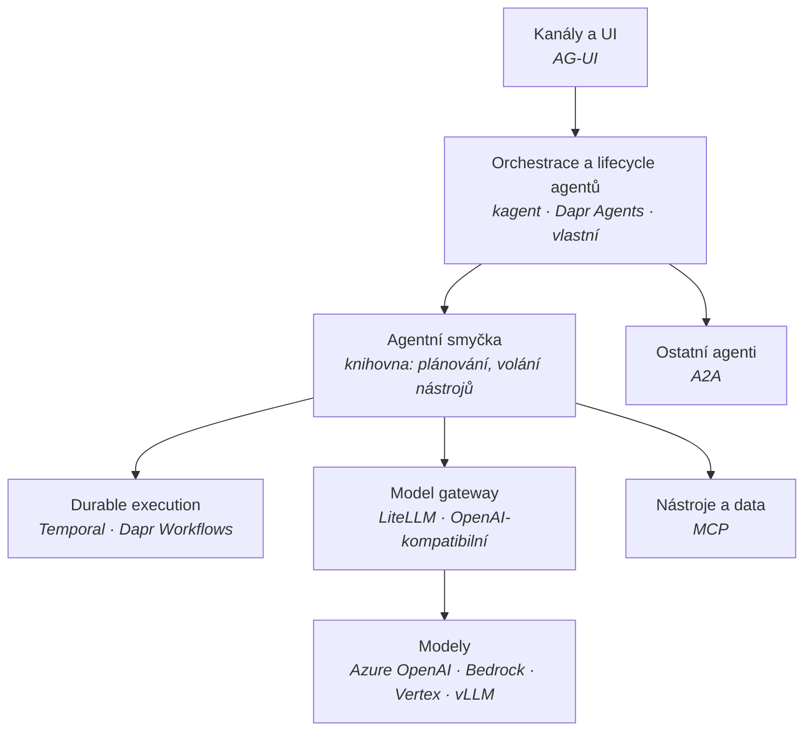

# Mapa agentních frameworků

Kontext: **multiagentní platforma dodávaná jako produkt do prostředí zákazníka** –
public cloud (Azure / AWS / GCP) i on-premises, výhradně z přenositelných open-source komponent,
bez licenčních pastí. Kritéria jsou v [kriteria.md](kriteria.md).

## Vrstvy – framework není jedna věc

Nejčastější chyba je porovnávat „frameworky" jako jednu kategorii. Ve skutečnosti jde
o několik vrstev, které lze skládat nezávisle – a právě ta nezávislost je obrana proti lock-inu.

**Protokoly drží švy.** Když hranice stojí na A2A, MCP a AG-UI (viz [`../protocols/overview.md`](../protocols/overview.md)),
je výměna orchestrační vrstvy prací na platformě, ne přepisem agentů. Bez toho je jakákoliv
volba frameworku jednosměrná.

Dvě vrstvy si zaslouží samostatnou pozornost, protože se v nich láme přenositelnost:
- **Durable execution** – [durable-execution.md](durable-execution.md)
- **Model gateway** – jediný šev, který odděluje Azure OpenAI od Bedrocku, Vertexu a lokálního vLLM.
  Bez něj je přístup k modelu napevno přibitý na jednoho poskytovatele.
  Kandidát: LiteLLM (SDK i proxy MIT; adresář `enterprise/` licencovaný zvlášť).

## Široké síto – kolo 1

Vyřazovací kritéria A1–A5 z [kriteria.md](kriteria.md). Ověřeno 2026-09-27.

| Framework | Licence (runtime) | Governance | A1 | Trvalost stavu | Výsledek |
|---|---|---|---|---|---|
| **Dapr Agents** | Apache-2.0 | **CNCF Graduated** (Dapr) | ✅ | V runtimu, stejná licence | **postupuje** |
| **kagent** | Apache-2.0 | **CNCF Sandbox** (od 5/2025) | ✅ | Externí | **postupuje** |
| **Microsoft Agent Framework** | MIT | Microsoft, jeden vendor | ✅ | Vestavěná správa stavu | **postupuje** |
| **Google ADK** | Apache-2.0 | Google, jeden vendor | ✅ | ověřit | postupuje s výhradou |
| **Pydantic AI** | MIT | Pydantic, jeden vendor | ✅ | Žádná – tenká knihovna | postupuje jako „tenká smyčka" |
| **OpenAI Agents SDK** | MIT | OpenAI, jeden vendor | ✅ | Žádná – tenká knihovna | postupuje jako „tenká smyčka" |
| **LlamaIndex Workflows** | MIT | LlamaIndex, jeden vendor | ✅ | ověřit | postupuje s výhradou |
| **CrewAI** | MIT | CrewAI, jeden vendor | ✅ | ověřit | postupuje s výhradou |
| **LangGraph** | knihovna MIT, **`langgraph-api` ELv2** | LangChain, jeden vendor | ❌ | **V komerční části** | **vyřazeno – A1** |
| **Mastra** | jádro Apache-2.0, **část Elastic** | Mastra, jeden vendor | ❌ | ověřit | **vyřazeno – A1** |

### Proč vypadl LangGraph

Knihovna `langgraph` je MIT. Ale `langgraph-api` – tedy **HTTP, persistence, fronty úloh
a streaming** – je pod **Elastic License 2.0** a aktivuje se i příkazy `langgraph dev`
a `langgraph build`. Produkční self-hosted provoz serverové části vyžaduje komerční klíč.

Přesně ty tři vlastnosti, kvůli kterým by se LangGraph do produktu nasazoval – trvalý stav,
schvalovací body přes restart, plánované běhy – jsou za licenční hranicí. Je to učebnicový
případ vzorce popsaného v [licencni-vzorce.md](licencni-vzorce.md).

To **nevylučuje LangGraph jako knihovnu** ve scénáři, kde si trvalost drží někdo jiný.
Vylučuje to LangGraph jako runtime dodávaného produktu.

## Top 3 pro hloubkové kolo

| # | Varianta | Silné stránky | Rizika |
|---|---|---|---|
| **1** | **Dapr Agents + Dapr Workflows** | Jediná kombinace „OSI licence + nadace + Graduated + durable execution v runtimu". Sidecar model je z principu cloud-agnostický. GA od 3/2026. | Mladý projekt navzdory zralosti Dapru. Sidecar je provozní režie navíc. Menší agentní ekosystém. |
| **2** | **kagent + externí durable vrstva** | Kubernetes-nativní od návrhu (CRD), A2A gateway a MCP registry přímo v produktu – tedy protokolová hranice jako vlastnost, ne dodatek. | CNCF **Sandbox** = nejnižší stupeň zralosti. Postavený na AutoGenu, který Microsoft v 4/2026 sloučil do Agent Frameworku – **je třeba ověřit, co to znamená pro jeho základ.** Trvalost si musíš dodat sám. |
| **3** | **Tenká smyčka + Temporal/Dapr + vlastní protokolová hranice** | Maximální přenositelnost a nulová závislost na jednom frameworku. Smyčka (Pydantic AI, OpenAI Agents SDK) je vyměnitelná za dny. | Nejvíc vlastního kódu. Lifecycle agentů, katalog a gateway si stavíš sám. |

**Pozn. Adam – doporučení:** začít hloubkové kolo variantou **1 vs. 2**, a variantu **3** držet
jako referenční dno. Varianta 3 totiž definuje, kolik práce framework ve skutečnosti ušetří –
bez ní se nedá posoudit, jestli se závislost vyplatí.

## Co ověřit v hloubkovém kole

- [ ] Dopad sloučení AutoGen + Semantic Kernel do Microsoft Agent Frameworku (4/2026) na základ kagentu.
- [ ] Vyžadují Temporal, Dapr Agents a kagent CLA? Jaký je bus factor mimo hlavního vendora?
- [ ] Google ADK, CrewAI, LlamaIndex Workflows – jak řeší trvalost stavu a v jaké licenci.
- [ ] Mastra – které komponenty přesně jsou pod Elastic licencí.
- [ ] Chová se `langgraph` bez `langgraph-api` jako použitelná knihovna, nebo je vazba těsná?
- [ ] DBOS jako durable vrstva – licence a governance.
- [ ] Platformní benchmark – návrh harnessu podle [kriteria.md](kriteria.md#proč-veřejné-benchmarky-neměří-framework).

## Changelog
- 2026-09-27: první verze; široké síto kolo 1, 10 kandidátů, LangGraph a Mastra vyřazeny na licenci.
