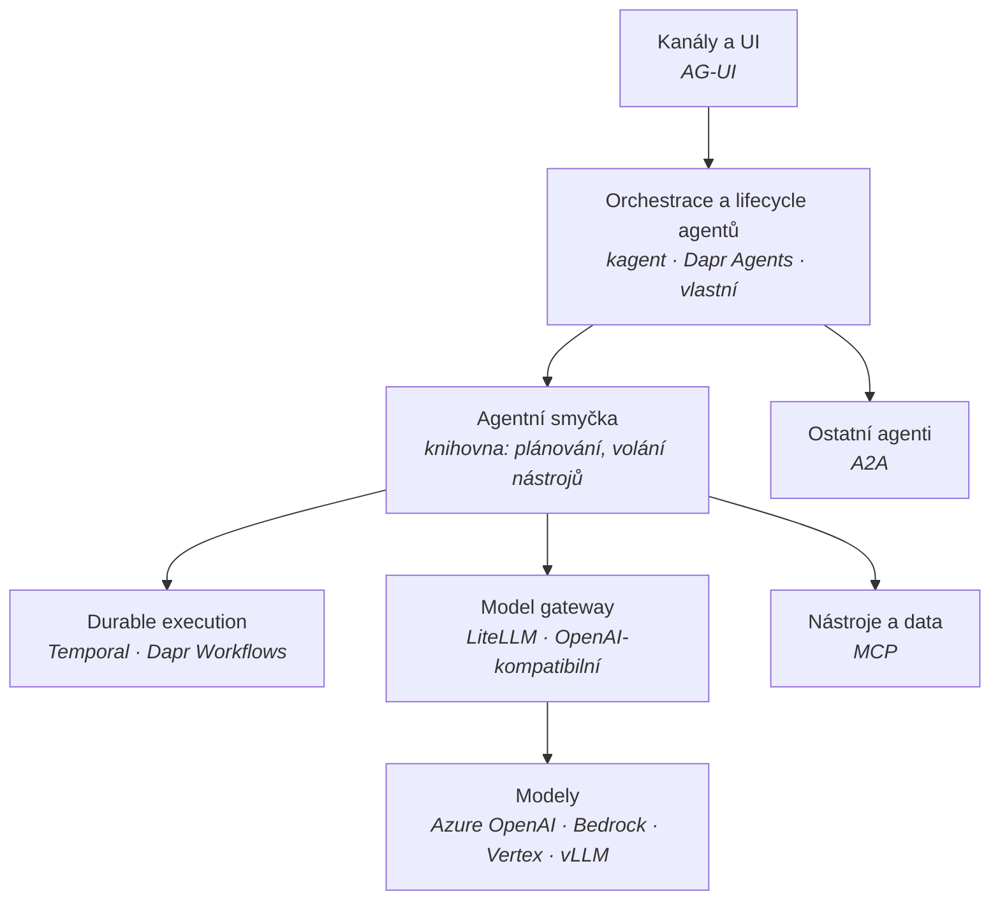

# Mapa agentních frameworků

Kontext: **multiagentní platforma dodávaná jako produkt do prostředí zákazníka** –
public cloud (Azure / AWS / GCP) i on-premises, výhradně z přenositelných open-source komponent,
bez licenčních pastí. Kritéria jsou v [kriteria.md](kriteria.md).

## Vrstvy – framework není jedna věc

Nejčastější chyba je porovnávat „frameworky" jako jednu kategorii. Ve skutečnosti jde
o několik vrstev, které lze skládat nezávisle – a právě ta nezávislost je obrana proti lock-inu.

**Protokoly drží švy.** Když hranice stojí na A2A, MCP a AG-UI (viz [`../protocols/overview.md`](../protocols/overview.md)),
je výměna orchestrační vrstvy prací na platformě, ne přepisem agentů. Bez toho je jakákoliv
volba frameworku jednosměrná.

Dvě vrstvy si zaslouží samostatnou pozornost, protože se v nich láme přenositelnost:
- **Durable execution** – [durable-execution.md](durable-execution.md)
- **Model gateway** – jediný šev, který odděluje Azure OpenAI od Bedrocku, Vertexu a lokálního vLLM.
  Bez něj je přístup k modelu napevno přibitý na jednoho poskytovatele.
  Kandidát: LiteLLM (SDK i proxy MIT; adresář `enterprise/` licencovaný zvlášť).

## Široké síto – kolo 1

Vyřazovací kritéria A1–A5 z [kriteria.md](kriteria.md). Ověřeno 2026-09-27.

| Framework | Licence (runtime) | Governance | A1 | Trvalost stavu | Výsledek |
|---|---|---|---|---|---|
| **[Dapr Agents](dapr-agents.md)** | Apache-2.0 | Apache-2.0, **DCO**, LF/CNCF – ale Graduated se týká **runtimu, ne sub-projektu** (repo 1/2025, graduace 10/2024) | ✅ | Ve **tvém** state storu, 28 providerů | **postupuje** |
| **[kagent](kagent.md)** | Apache-2.0 (celý stack) | CNCF **Sandbox**; žádost o Incubating od 12/2025 bez posunu; **DCO, ne CLA** | ✅ | Postgres v runtimu (v0.10+); checkpointy a durable HITL až ve v1.0-alpha | **postupuje, ale jen linie v0.10.x** |
| **[Microsoft Agent Framework](microsoft-agent-framework.md)** | MIT (celý stack) | Microsoft, jeden vendor, **skrytá CLA**; žádná nadace, versioning ani support policy | ✅ | ⚠️ checkpointy v jádře, ale produkční store **jen Cosmos**; durable execution **jen přes Azure DTS** | **jen jako tenká smyčka** |
| **Google ADK** | Apache-2.0 | Google, jeden vendor, **CLA**, žádná nadace ani versioning/support policy | ✅ | `DatabaseSessionService` = store konverzace, **ne durable execution**; resume `@experimental`, default off, **at-least-once** | **nehodnocen samostatně** – prověřen jako [smyčka pod kagentem](kagent.md#google-adk-pod-kapotou) |
| **Pydantic AI** | MIT | Pydantic, jeden vendor | ✅ | Žádná – tenká knihovna | postupuje jako „tenká smyčka" |
| **OpenAI Agents SDK** | MIT | OpenAI, jeden vendor | ✅ | Žádná – tenká knihovna | postupuje jako „tenká smyčka" |
| **LlamaIndex Workflows** | MIT | LlamaIndex, jeden vendor | ✅ | ověřit | postupuje s výhradou |
| **CrewAI** | MIT | CrewAI, jeden vendor | ✅ | ověřit | postupuje s výhradou |
| **LangGraph** | knihovna MIT, **`langgraph-api` ELv2** | LangChain, jeden vendor | ❌ | **V komerční části** | **vyřazeno – A1** |
| **Mastra** | jádro Apache-2.0, **část Elastic** | Mastra, jeden vendor | ❌ | ověřit | **vyřazeno – A1** |

### Proč vypadl LangGraph

Knihovna `langgraph` je MIT. Ale `langgraph-api` – tedy **HTTP, persistence, fronty úloh
a streaming** – je pod **Elastic License 2.0** a aktivuje se i příkazy `langgraph dev`
a `langgraph build`. Produkční self-hosted provoz serverové části vyžaduje komerční klíč.

Přesně ty tři vlastnosti, kvůli kterým by se LangGraph do produktu nasazoval – trvalý stav,
schvalovací body přes restart, plánované běhy – jsou za licenční hranicí. Je to učebnicový
případ vzorce popsaného v [licencni-vzorce.md](licencni-vzorce.md).

To **nevylučuje LangGraph jako knihovnu** ve scénáři, kde si trvalost drží někdo jiný.
Vylučuje to LangGraph jako runtime dodávaného produktu.

## Co do síta nepatří a proč

Jak trh houstne, přibývá projektů, které *vypadají* relevantně, ale řeší jinou vrstvu
nebo jiný druh softwaru. Aby se nemusely posuzovat pokaždé znovu, patří sem i výsledek
záporného posouzení.

**Dělicí otázka:** obsluhuje to víc agentů a víc uživatelů současně jako sdílená
infrastruktura, nebo je to software pro jednoho člověka na jednom zařízení?

| Projekt | Co to je | Proč nepatří do síta |
|---|---|---|
| **OpenMuse** (CopilotKit, MIT, alpha) | Osobní agent pro iOS, Android a web – prohlížeč, terminál, soubory, trezor kredencí, paměť, cíle | Osobní aplikace, ne platformní runtime. Bez multi-tenancy, bez Kubernetes. Padá na A2 a A4 ne kvůli kvalitě, ale kvůli kategorii. **Hodnotu má jinde:** je to referenční implementace AG-UI – viz [`../protocols/ag-ui.md`](../protocols/ag-ui.md#referenční-implementace) |

**Pozn. Adam:** u projektů z téhle kategorie stojí za to se vždy zeptat, jestli nemají
cenu jako *referenční kód* pro vrstvu, kterou si stejně budeme stavět sami. OpenMuse je
přesně takový případ – AG-UI dnes neumí ani jeden z finalistů.

## Top 3 pro hloubkové kolo

| # | Varianta | Silné stránky | Rizika |
|---|---|---|---|
| **1** | **[Dapr Agents](dapr-agents.md) + Dapr Workflows** | **Nejlepší cena odchodu v poli:** stav leží ve *tvém* state storu (28 providerů) v dokumentovaném append-only formátu. Durable HITL včetně checkpointu ve stavu čekání. PyPI deklaruje licenci. DCO. Air-gap doložený. Model gateway šev otevřený (`base_url`, LiteLLM je přímá závislost). | **CNCF Graduated se na sub-projekt nevztahuje.** Žádná support ani versioning policy. **Breaking change v patch releasu** měsíc po GA. Bus factor 2. **A2A ani AG-UI nepodporuje vůbec.** Vedle repa BUSL balíčky propagované z docs.dapr.io. |
| **2** | **[kagent](kagent.md)** – jen linie v0.10.x | Celý stack Apache-2.0, **DCO**, trademark u CNCF. A2A v1.0 a MCP přes oficiální SDK. Abstrakce **Harness** dělá runtime agenta vyměnitelným. Nulové phone-home. **Model gateway šev otevřený** – `BaseURL` přepisuje defaulty, self-hosted vLLM funguje. | **Linie v1.0 je mimo hru:** Substrate je tam fakticky povinný (neprázdný default endpointu + nepodmíněný blokující `Dial`), čímž padá A2 i A3. Rewrite bez migrační cesty a bez HA gateway. Bus factor 7/8 Solo.io. **Žádná podpora AG-UI.** PyPI balíčky bez licenčních metadat. Agentní smyčka je **Google ADK** – CLA, bez nadace, breaking changes v minorech; HITL resume je ADK `@experimental` s **at-least-once**; artefakty vždy in-memory; v0.10.x jede na ADK 1.x bez release od 2026-08-27. |
| **3** | **[MAF](microsoft-agent-framework.md) jako tenká smyčka + Dapr Workflow nebo Temporal** | **Jediná varianta, která pokrývá protokolovou hranici celou** – MAF má A2A, MCP i AG-UI přes oficiální SDK a nejlepší OTEL profil, vše MIT. Trvalost dodá cizí durable vrstva, takže Azure gravitace MAF zmizí. | Nejvíc vlastního kódu: vlastní `CheckpointStorage` a `AgentSessionStore` (Microsoft druhý nedodává vůbec). Microsoft CLA a ~16 breaking changes za 5,5 měsíce – verzi přišpendlit, upgrade rozpočtovat. |

**Pozn. Adam – doporučení po hloubkovém kole (2026-09-29):** všechny tři prověrky
**snížily důvěru**, každá jinde:

| Kandidát | Kde to padlo |
|---|---|
| kagent | zralost rewritu v1.0 a Substrate rozbíjející air-gap |
| Dapr Agents | „CNCF Graduated" se na sub-projekt nevztahuje; žádná support policy |
| Microsoft Agent Framework | durable execution jen přes placenou Azure službu; skrytá CLA a nulová versioning policy |

**Protokolovou hranici celou pokrývá jen MAF** – A2A i MCP přes oficiální SDK a AG-UI v GA.
Těžiště proto zůstává u **varianty 3**, ale mění se její obsah: tenkou smyčkou s hranicí
může být MAF, durable substrátem Dapr Workflow nebo Temporal. MAF se přitom nesmí dát
durable vrstva – tím se obejde jeho jediná tvrdá vazba na Azure.

## Co ověřit dál

Uzavřeno 2026-09-28: dopad sloučení AutoGenu na kagent (přechod na ADK už ve v0.5.0);
CLA u kagentu i Dapr Agents (oba DCO).

- [x] ~~Jsou MSSQL či Netherite backendy použitelné pro MAF mimo Azure?~~ –
      **uzavřeno: MSSQL ano, ale jen .NET; Netherite končí 2028-03-31.** MAF backend
      nevynucuje, past je v dokumentované cestě a v Python SDK.
- [ ] Odhadnout práci na vlastním `CheckpointStorage` (Postgres) a `AgentSessionStore` pro MAF.
- [ ] Lze MAF workflow spustit nad Dapr Workflow nebo Temporalem bez `agent-framework-durabletask`?
- [ ] **Právní posudek Diagrid BSL** – vylučují prahy 60 FTE / 15 M USD a zákaz komerční
      redistribuce balíčky `diagrid` i z vývoje, nebo jen z produkce? Do té doby `diagrid*`
      na deny-list v license gate.
- [x] ~~kagent: je Substrate v linii v1.0 povinný?~~ – **uzavřeno: ano, fakticky povinný.**
      A2 i A3 pro v1.0 padají; v0.10.x ho má opt-in.
- [x] ~~kagent: váže `credential-injection` modely na pevný výčet DNS hostnames?~~ –
      **uzavřeno: ne, obava vyvrácena.** Model gateway šev je otevřený.
- [ ] **Dapr Workflow jako substrát pod tenkou smyčkou bez `diagrid`** – odhadnout práci
      na vlastním obalu nad `dapr-ext-workflow`.
- [ ] Cena vlastního A2A serveru nad `a2a-sdk` vedle Dapr Agents.
- [ ] Změřit harnessem: pozastavení HITL → restart clusteru → obnovení po 14 dnech.
- [ ] Síťový test air-gapped u obou kandidátů.
- [x] ~~Google ADK – trvalost stavu a licence~~ – **uzavřeno 2026-09-29** jako závislost
      kagentu, ne samostatný kandidát.
- [ ] **Získat vyjádření k support oknu ADK 1.x** – z veřejných zdrojů to zjistit nejde
      (ověřeno 2026-09-29). Přímé provozní riziko pro doporučenou linii kagent v0.10.x.
- [ ] CrewAI, LlamaIndex Workflows – trvalost stavu a licence.
- [ ] Mastra – které komponenty přesně jsou pod Elastic licencí.
- [ ] Je `langgraph` bez `langgraph-api` použitelný jako pouhá knihovna?
- [ ] DBOS jako durable vrstva – licence a governance.
- [ ] Návrh harnessu pro platformní benchmark.

## Changelog
- 2026-09-27: první verze; široké síto kolo 1, 10 kandidátů, LangGraph a Mastra vyřazeny na licenci.
- 2026-09-29: prověřen Google ADK jako smyčka pod kagentem. Korekce v `kagent.md`:
  kagentí Postgres nestojí na ADK `[db]`, HITL resume je už ve v0.10.x, ale at-least-once.
- 2026-09-29: kagent ověřen čtením kódu – Substrate je ve v1.0 fakticky povinný
  (A2 i A3 padají), v0.10.x ho má opt-in. Obava o allowlist hostnames vyvrácena.
- 2026-09-29: ověřen durable backend MAF – `Microsoft.DurableTask.SqlServer` je cesta
  mimo Azure, ale jen pro .NET; Netherite vyřazen. Doporučení se nemění.
- 2026-09-29: hloubková prověrka Microsoft Agent Frameworku. Korekce: „vestavěná správa
  stavu" byla nepřesná – produkční checkpoint store je jen Azure Cosmos DB a durable
  execution má jediný produkční backend (Azure DTS). Ověřena skrytá Microsoft CLA.
  MAF je jediný kandidát s AG-UI; těžiště doporučení upřesněno u varianty 3.
- 2026-09-29: přidána sekce „Co do síta nepatří a proč"; posouzen OpenMuse – osobní
  agentní aplikace, do síta nepatří, ale je referenční implementací AG-UI.
- 2026-09-28: hloubkové prověrky kagentu a Dapr Agents. Korekce: kagent nemá MCP registry
  ani AG-UI a trvalost už neleží mimo runtime; u Dapr Agents se CNCF Graduated nevztahuje
  na sub-projekt. Těžiště doporučení posunuto k variantě 3.
