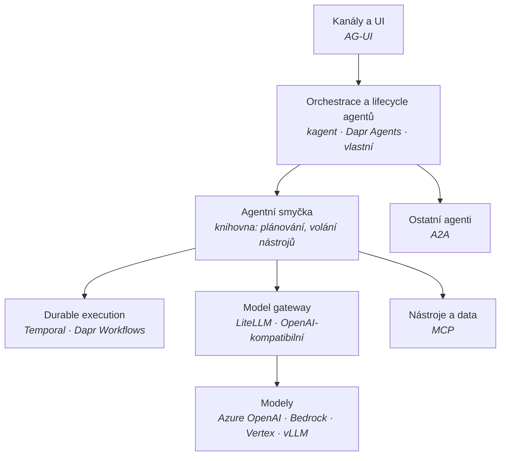

# Mapa agentních frameworků

Kontext: **multiagentní platforma dodávaná jako produkt do prostředí zákazníka** –
public cloud (Azure / AWS / GCP) i on-premises, výhradně z přenositelných open-source komponent,
bez licenčních pastí. Kritéria jsou v [kriteria.md](kriteria.md).

## Vrstvy – framework není jedna věc

Nejčastější chyba je porovnávat „frameworky" jako jednu kategorii. Ve skutečnosti jde
o několik vrstev, které lze skládat nezávisle – a právě ta nezávislost je obrana proti lock-inu.

**Protokoly drží švy.** Když hranice stojí na A2A, MCP a AG-UI (viz [`../protocols/overview.md`](../protocols/overview.md)),
je výměna orchestrační vrstvy prací na platformě, ne přepisem agentů. Bez toho je jakákoliv
volba frameworku jednosměrná.

Dvě vrstvy si zaslouží samostatnou pozornost, protože se v nich láme přenositelnost:
- **Durable execution** – [durable-execution.md](durable-execution.md)
- **Model gateway** – jediný šev, který odděluje Azure OpenAI od Bedrocku, Vertexu a lokálního vLLM.
  Bez něj je přístup k modelu napevno přibitý na jednoho poskytovatele.
  Kandidát: LiteLLM (SDK i proxy MIT; adresář `enterprise/` licencovaný zvlášť).

## Široké síto – kolo 1

Vyřazovací kritéria A1–A5 z [kriteria.md](kriteria.md). Ověřeno 2026-09-27.

| Framework | Licence (runtime) | Governance | A1 | Trvalost stavu | Výsledek |
|---|---|---|---|---|---|
| **[Dapr Agents](dapr-agents.md)** | Apache-2.0 | Apache-2.0, **DCO**, LF/CNCF – ale Graduated se týká **runtimu, ne sub-projektu** (repo 1/2025, graduace 10/2024) | ✅ | Ve **tvém** state storu, 28 providerů | **postupuje** |
| **[kagent](kagent.md)** | Apache-2.0 (celý stack) | CNCF **Sandbox**; žádost o Incubating od 12/2025 bez posunu; **DCO, ne CLA** | ✅ | Postgres v runtimu (v0.10+); checkpointy a durable HITL až ve v1.0-alpha | **postupuje** |
| **Microsoft Agent Framework** | MIT | Microsoft, jeden vendor | ✅ | Vestavěná správa stavu | **postupuje** |
| **Google ADK** | Apache-2.0 | Google, jeden vendor | ✅ | ověřit | postupuje s výhradou |
| **Pydantic AI** | MIT | Pydantic, jeden vendor | ✅ | Žádná – tenká knihovna | postupuje jako „tenká smyčka" |
| **OpenAI Agents SDK** | MIT | OpenAI, jeden vendor | ✅ | Žádná – tenká knihovna | postupuje jako „tenká smyčka" |
| **LlamaIndex Workflows** | MIT | LlamaIndex, jeden vendor | ✅ | ověřit | postupuje s výhradou |
| **CrewAI** | MIT | CrewAI, jeden vendor | ✅ | ověřit | postupuje s výhradou |
| **LangGraph** | knihovna MIT, **`langgraph-api` ELv2** | LangChain, jeden vendor | ❌ | **V komerční části** | **vyřazeno – A1** |
| **Mastra** | jádro Apache-2.0, **část Elastic** | Mastra, jeden vendor | ❌ | ověřit | **vyřazeno – A1** |

### Proč vypadl LangGraph

Knihovna `langgraph` je MIT. Ale `langgraph-api` – tedy **HTTP, persistence, fronty úloh
a streaming** – je pod **Elastic License 2.0** a aktivuje se i příkazy `langgraph dev`
a `langgraph build`. Produkční self-hosted provoz serverové části vyžaduje komerční klíč.

Přesně ty tři vlastnosti, kvůli kterým by se LangGraph do produktu nasazoval – trvalý stav,
schvalovací body přes restart, plánované běhy – jsou za licenční hranicí. Je to učebnicový
případ vzorce popsaného v [licencni-vzorce.md](licencni-vzorce.md).

To **nevylučuje LangGraph jako knihovnu** ve scénáři, kde si trvalost drží někdo jiný.
Vylučuje to LangGraph jako runtime dodávaného produktu.

## Top 3 pro hloubkové kolo

| # | Varianta | Silné stránky | Rizika |
|---|---|---|---|
| **1** | **[Dapr Agents](dapr-agents.md) + Dapr Workflows** | **Nejlepší cena odchodu v poli:** stav leží ve *tvém* state storu (28 providerů) v dokumentovaném append-only formátu. Durable HITL včetně checkpointu ve stavu čekání. PyPI deklaruje licenci. DCO. Air-gap doložený. Model gateway šev otevřený (`base_url`, LiteLLM je přímá závislost). | **CNCF Graduated se na sub-projekt nevztahuje.** Žádná support ani versioning policy. **Breaking change v patch releasu** měsíc po GA. Bus factor 2. **A2A ani AG-UI nepodporuje vůbec.** Vedle repa BUSL balíčky propagované z docs.dapr.io. |
| **2** | **[kagent](kagent.md)** | Celý stack Apache-2.0, **DCO**, trademark u CNCF. **A2A v1.0 a MCP přes oficiální SDK** – nejlepší protokolový profil. Abstrakce **Harness** dělá runtime agenta vyměnitelným (ADK / Claude / Codex / BYO). Nulové phone-home. | Paralelní rewrite **v1.0-alpha bez migrační cesty a bez HA gateway**. Závislost **Substrate rozbíjí air-gap**. Bus factor 7/8 Solo.io. Žádost o Incubating leží od 12/2025. **Žádná podpora AG-UI.** PyPI balíčky bez licenčních metadat. |
| **3** | **Tenká smyčka + Dapr Workflow nebo Temporal + vlastní hranice** | Maximální přenositelnost. **Dapr Workflow umí být substrátem pod cizí tenkou smyčkou** – tím se varianta posouvá z „nejvíc práce" na nejlepší poměr trvalost / nulová vazba. | Nejvíc vlastního kódu. Hotová implementace té integrace je pod **BUSL** – OSS cestou je vlastní obal nad `dapr-ext-workflow`. |

**Pozn. Adam – doporučení po hloubkovém kole (2026-09-28):** obě prověrky **snížily důvěru,
ne zvýšily** – každá z jiného důvodu. Žádný z finalistů zároveň nepokrývá protokolovou
hranici celou: kagent má A2A i MCP přes oficiální SDK, ale AG-UI odmítl; Dapr Agents mají
jen MCP klienta.

Proto se těžiště posouvá k **variantě 3**: Dapr Workflow jako durable substrát pod tenkou
vyměnitelnou smyčkou, s vlastní protokolovou hranicí nad `a2a-sdk`. Dostaneš trvalost
v Apache-2.0 a smyčku, která se vymění za dny. Cenou je vlastní obal nad `dapr-ext-workflow`
(hotová integrace je pod BUSL) a vlastní A2A server.

## Co ověřit dál

Uzavřeno 2026-09-28: dopad sloučení AutoGenu na kagent (přechod na ADK už ve v0.5.0);
CLA u kagentu i Dapr Agents (oba DCO).

- [ ] **Právní posudek Diagrid BSL** – vylučují prahy 60 FTE / 15 M USD a zákaz komerční
      redistribuce balíčky `diagrid` i z vývoje, nebo jen z produkce? Do té doby `diagrid*`
      na deny-list v license gate.
- [ ] **kagent: je Substrate v linii v1.0 povinný, nebo volitelný?** Visí na tom vanilla
      Kubernetes i air-gap. Nutno číst kód controlleru.
- [ ] **kagent v1.0: váže `credential-injection` modely na pevný výčet DNS hostnames?**
- [ ] **Dapr Workflow jako substrát pod tenkou smyčkou bez `diagrid`** – odhadnout práci
      na vlastním obalu nad `dapr-ext-workflow`.
- [ ] Cena vlastního A2A serveru nad `a2a-sdk` vedle Dapr Agents.
- [ ] Změřit harnessem: pozastavení HITL → restart clusteru → obnovení po 14 dnech.
- [ ] Síťový test air-gapped u obou kandidátů.
- [ ] Google ADK, CrewAI, LlamaIndex Workflows – trvalost stavu a licence.
- [ ] Mastra – které komponenty přesně jsou pod Elastic licencí.
- [ ] Je `langgraph` bez `langgraph-api` použitelný jako pouhá knihovna?
- [ ] DBOS jako durable vrstva – licence a governance.
- [ ] Návrh harnessu pro platformní benchmark.

## Changelog
- 2026-09-27: první verze; široké síto kolo 1, 10 kandidátů, LangGraph a Mastra vyřazeny na licenci.
- 2026-09-28: hloubkové prověrky kagentu a Dapr Agents. Korekce: kagent nemá MCP registry
  ani AG-UI a trvalost už neleží mimo runtime; u Dapr Agents se CNCF Graduated nevztahuje
  na sub-projekt. Těžiště doporučení posunuto k variantě 3.
